Nesse projeto, foi elaborado um circuito em um programa de simulação, um retificador de onda de corrente elétrica. 

Veja a seguir, imagens do circuito.

------------------------------------------------------

<h1>Schematic Capture.<h1>

Esquemático do circuito de retificador de onda com ponte de diodo.

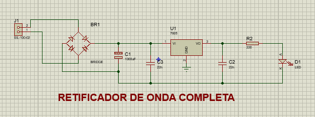

------------------------------------------------------

------------------------------------------------------

<h1>Schematic Capture.<h1>

Esquemático do circuito de retificador de onda com diodo manual.

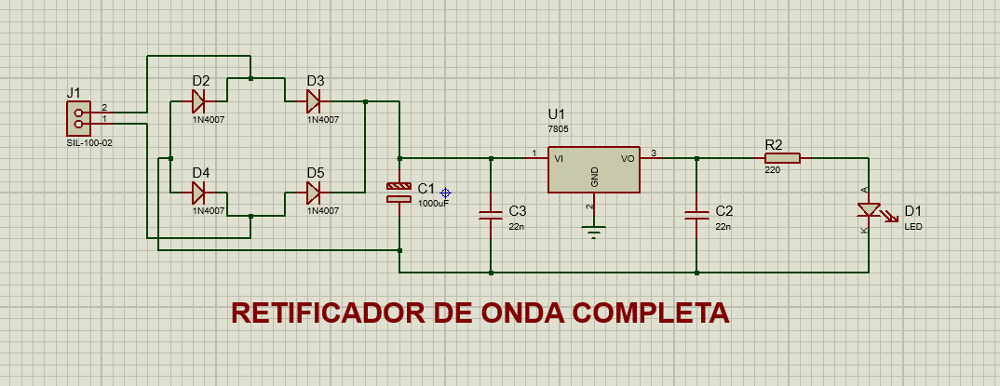

------------------------------------------------------

------------------------------------------------------

<h1>Pcb Layout.<h1>

Pcb layout do circuito de retificador de onda com ponte de diodo.

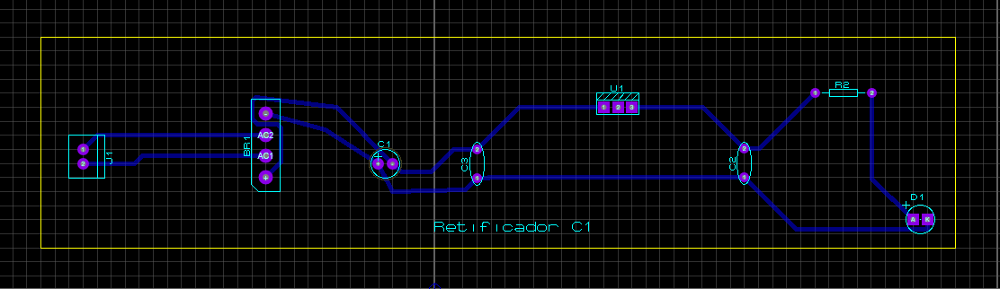

------------------------------------------------------

------------------------------------------------------

<h1>Pcb Layout.<h1>

Pcb layout do circuito de retificador de onda com diodo manual.

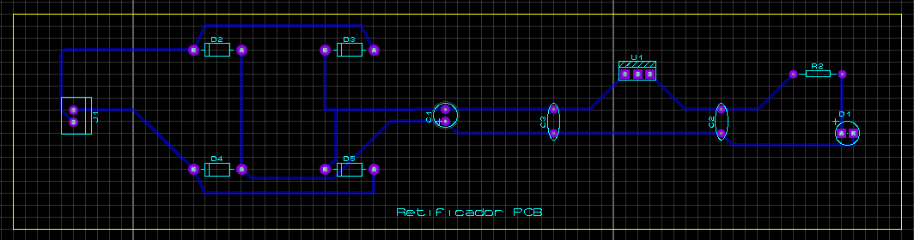

------------------------------------------------------

------------------------------------------------------

<h1>3d Visual.<h1>

3d Visual do circuito de retificador de onda com ponte de diodo, parte superior.

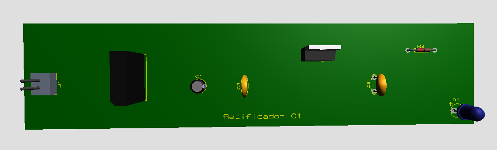

------------------------------------------------------

------------------------------------------------------

<h1>3d Visual.<h1>

3d Visual do circuito de retificador de onda com ponte de diodo, parte inferior.

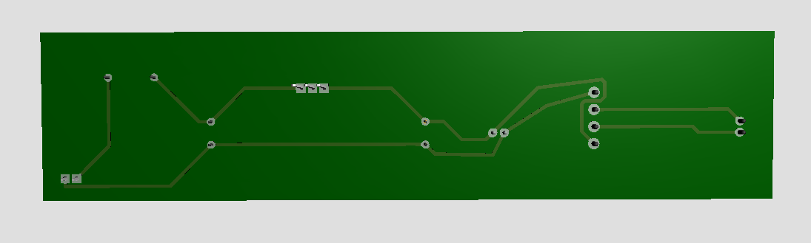

------------------------------------------------------

------------------------------------------------------

<h1>3d Visual.<h1>

3d Visual do circuito de retificador de onda com diodo manual, parte superior.

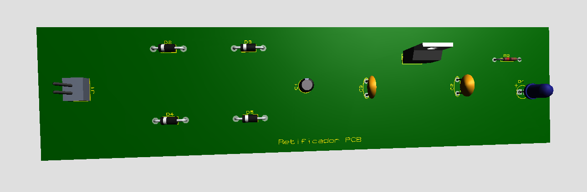

------------------------------------------------------

------------------------------------------------------

<h1>3d Visual.<h1>

3d Visual do circuito de retificador de onda com diodo manual, parte inferior.

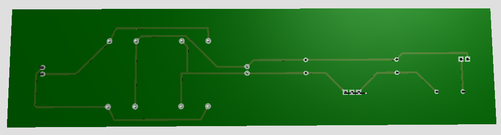

------------------------------------------------------

------------------------------------------------------

<h1>Schematic Capture Tinkercad.<h1>

Esquemático do circuito de retificador de onda com diodo manual, feito no Tinkercad.

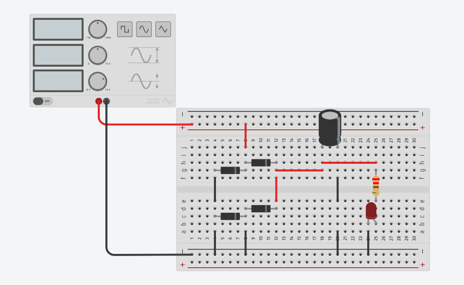

------------------------------------------------------

------------------------------------------------------

<h1>Schematic Capture Tinkercad.<h1>

Esquemático do circuito de retificador de onda com regulador de tenção LM7805, feito no Tinkercad.

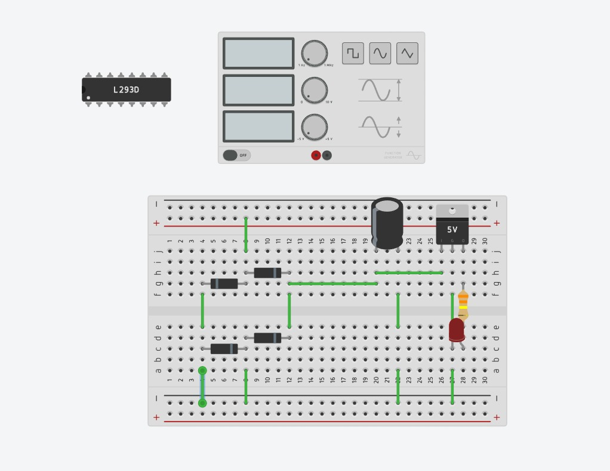

------------------------------------------------------

------------------------------------------------------

<h1>Schematic Capture Tinkercad.<h1>

Esquemático do circuito de retificador de onda com regulador de tenção LM7809, feito no Tinkercad.

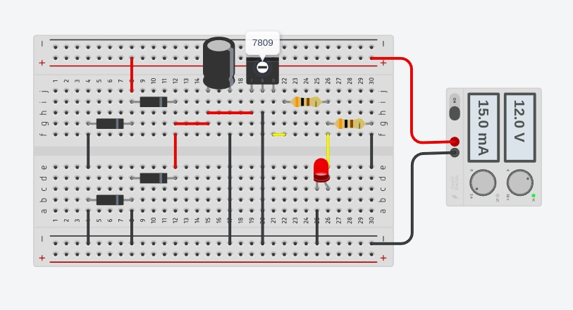

------------------------------------------------------

------------------------------------------------------

<h1>Retificador Protoboard.<h1>

Retificador feito manualmente na protoboard, com regulador de tensão LM7805, feito em sala.

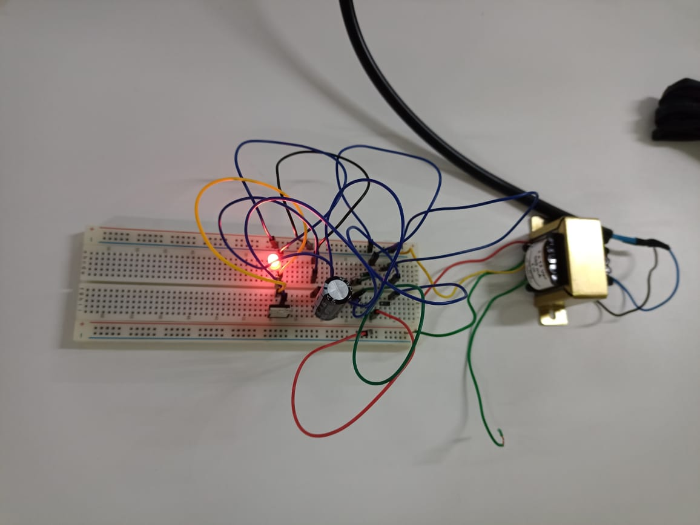

------------------------------------------------------

------------------------------------------------------

<h1>Retificador Protoboard.<h1>

Retificador feito manualmente na protoboard, com regulador de tensão LM7809, feito em sala.

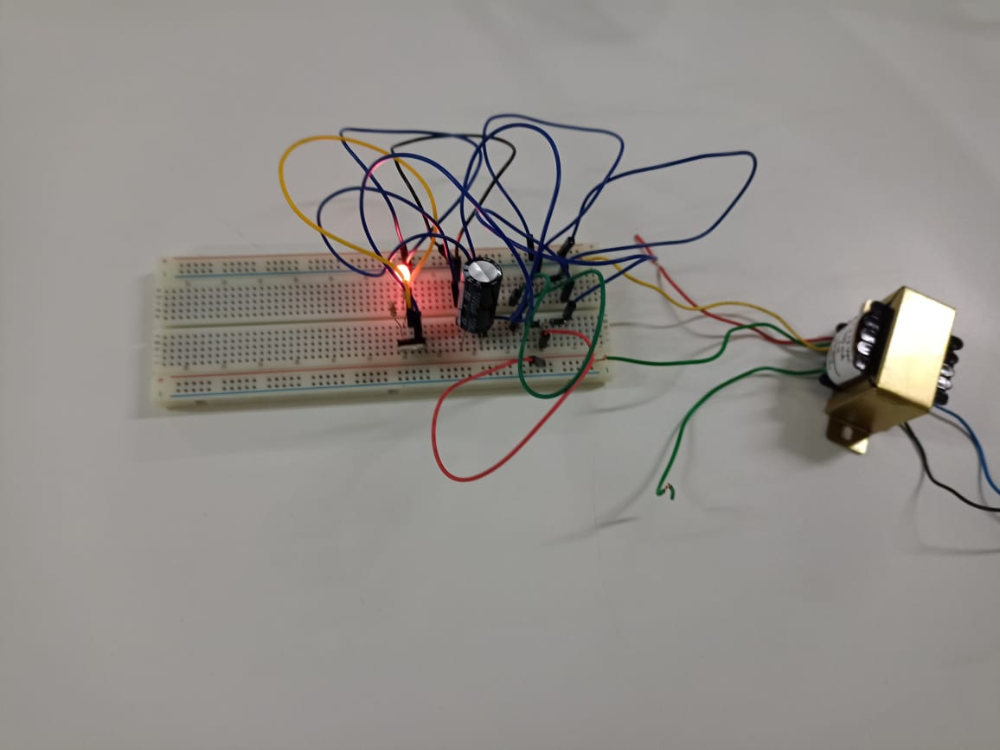

------------------------------------------------------

------------------------------------------------------

<h1>Funcionamento de um Retificador.<h1>

O retificador de onda completa converte ambas as metades de cada ciclo de forma de onda em sinal DC pulsante usando quatro diodos de retificação.

------------------------------------------------------

------------------------------------------------------

Para este projeto foi utilizado dois programas bem uteis para montar circuitos,
e modelagem em 3D, trata-se do Proteus 8 Professional e Tinkercad.

------------------------------------------------------

------------------------------------------------------

<h1>Proteus 8 Professional.<h1>

Programa bastante utilizado para montar circuitos, onde temos a visão do Esquemático, do Pcb Layout
e a Visão 3D.

------------------------------------------------------

------------------------------------------------------

<h1>Tinkercad.<h1>

Programa bastante utilizado para montar estruturas em 3D, seja ela um circuito,
uma maquete de uma máquina, entre outros.

